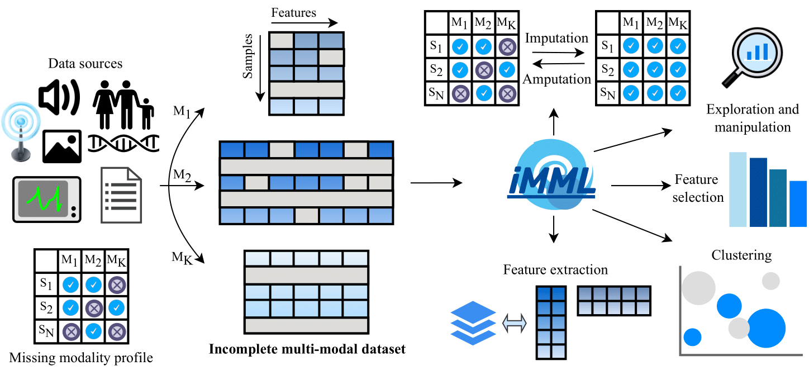

Overview
====================

`iMML` is a Python package that provides a robust tool-set for integrating, processing, and analyzing incomplete
multi-modal datasets to support a wide range of machine learning tasks. Starting with a dataset containing N samples
with K modalities, `iMML` effectively handles missing data for clustering, imputation, feature
selection, feature extraction and data exploration, hence enabling efficient analysis of partially observed samples.

<div align="center">


**Overview of iMML for multi-modal learning with incomplete data**
</div>

Background
----------

Multi-modal learning, where diverse data types are integrated and analyzed together, has emerged as a critical field
in artificial intelligence. Multi-modal machine learning models that effectively integrate multiple data modalities
generally outperform their uni-modal counterparts by leveraging more comprehensive and complementary information.
However, **most algorithms in this field assume fully observed data**, an assumption that is often
unrealistic in real-world scenarios.

Motivation
----------

Real-world multi-modal datasets are often incomplete, leading to a limited performance or failure of conventional
multi-modal learning methods. Learning from incomplete multi-modal data has seen exponential growth since 2016.
Despite this growth, **the community still lacks tools that can effectively handle incomplete multi-modal data**.

Key features
------------

To address this gap, we have developed `iMML`, a Python package designed for multi-modal learning with incomplete data.
The key features of this package are:

-   **Comprehensive toolkit**: `iMML` provides a broad set of tools for integrating, processing, and analyzing
    incomplete multi-modal datasets implemented as a single, user-friendly interface to facilitate adoption by
    a wide community of users.
-   **Accessible**: `iMML` makes the tools readily available to the Python community, simplifying their usage,
    comparison, and benchmarking, and thereby addresses the current lack of resources for handling incomplete
    multi-modal data.
-   **Extensible**: `iMML` provides a common framework where researchers can contribute and
    integrate new approaches, serving as a community platform for hosting new algorithms and methods.

Usage
--------

This package provides a user-friendly interface to apply these algorithms to user-provided data. Moreover, it is
compatible with Scikit-learn and can be easily integrated into Scikit-learn pipelines for data preprocessing and
modeling.

For this demonstration, we will generate a random dataset, that we have called `Xs`, as a multi-modal dataset
to simulate a multi-modal scenario:

```python
import numpy as np
Xs = [np.random.random((10,5)) for i in range(3)] # or your multi-modal dataset
```

You can use any other complete or incomplete multi-modal dataset. Once you have your dataset ready, you can
leverage the `iMML` library for a wide range of machine learning tasks, such as:

- Decompose a multi-modal dataset using ``MOFA`` to capture joint information.

```python
from imml.decomposition import MOFA
transformed_Xs = MOFA().fit_transform(Xs)
```

- Cluster samples from a multi-modal dataset using ``NEMO`` to find hidden groups.

```python
from imml.cluster import NEMO
labels = NEMO().fit_predict(Xs)
```

- Simulate incomplete multi-modal datasets for evaluation and testing purposes using ``Amputer``.

```python
from imml.ampute import Amputer
transformed_Xs = Amputer(p=0.8).fit_transform(Xs)
```

Free software
-------------

`iMML` is free software; you can redistribute it and/or modify it under the terms of the `GNU GPLv3`.

Contribute
------------

We welcome practitioners, researchers, and the open-source community to contribute to the `iMML` project, and in doing
so, helping us extend and refine the library for the community. Such a community-wide effort will make `iMML` more
versatile, sustainable, powerful, and accessible to the machine learning community across many domains.

Citing `iMML`
----------------

If you find the package useful for your project, please cite our paper.

BibTeX entry:


